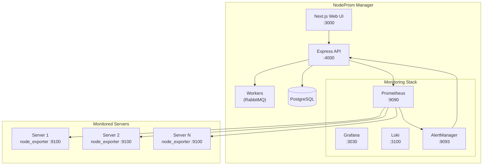
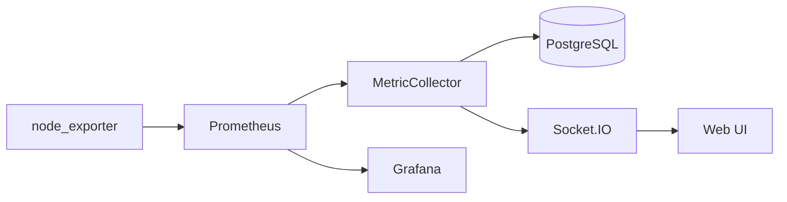
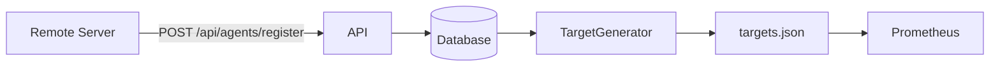
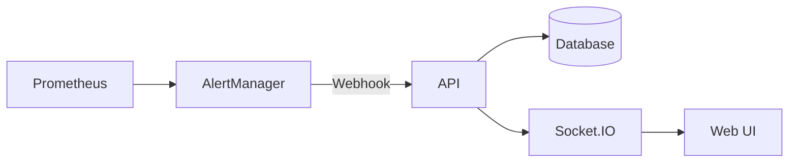

# Architecture Overview

## System Architecture

## Package Structure

| Package | Port | Purpose |
|---------|------|---------|
| `@nodeprism/web` | 3000 | Next.js management UI |
| `@nodeprism/api` | 4000 | Express REST API + WebSocket |
| `@nodeprism/deployment-worker` | - | SSH agent deployment |
| `@nodeprism/config-sync` | - | Configuration synchronization |
| `@nodeprism/anomaly-detector` | - | ML anomaly detection |
| `@nodeprism/agent-app` | 9101 | Custom app monitoring agent |
| `@nodeprism/shared` | - | Shared types and utilities |

## Data Flow

### 1. Metrics Collection

### 2. Agent Registration

### 3. Alert Processing

## Technology Stack

| Category | Technology |
|----------|------------|
| Language | TypeScript 5.3+ |
| Runtime | Node.js 20+ |
| Package Manager | PNPM 8+ |
| Build | Turborepo |
| Database | PostgreSQL 15 |
| Cache | Redis 7 |
| Queue | RabbitMQ 3.13 |
| Monitoring | Prometheus, Grafana, Loki |

## Ports Reference

| Service | Port | Notes |
|---------|------|-------|
| **Nginx (reverse proxy)** | **80** | Public entry point — proxies to Web UI + API |
| Web UI (Next.js) | 3000 | Internal, proxied via nginx |
| API (Express) | 4000 | Internal, proxied via nginx |
| Config Sync | 4002 | Background worker (no HTTP) |
| Anomaly Detector | 4003 | Background worker (no HTTP) |
| PostgreSQL | 5432 | |
| Redis | 6379 | |
| RabbitMQ | 5672 | |
| RabbitMQ Management | 15672 | |
| Prometheus | 9090 | |
| Grafana | 3030 | |
| Loki | 3100 | |
| AlertManager | 9093 | |
| Pushgateway | 9091 | |
| Agent App | 9101 | |
| Node Exporter | 9100 | |
| Docusaurus Docs | 3080 | |

> **Note:** Remote servers only need outbound access to port **80** on the manager to install agents and register. Nginx on port 80 proxies `/agent-install.sh` → API (4000), `/api/*` → API (4000), and everything else → Web UI (3000).
