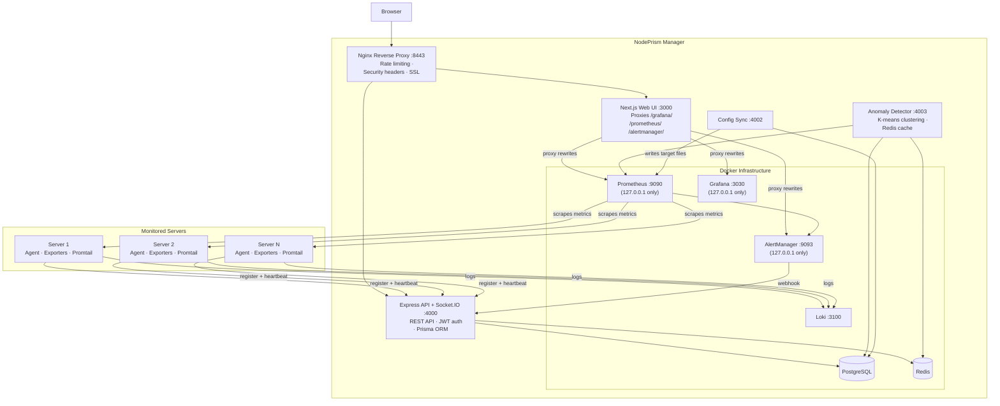
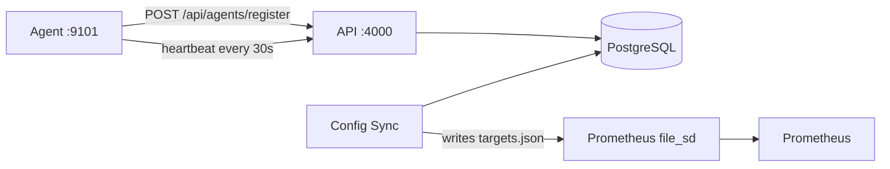
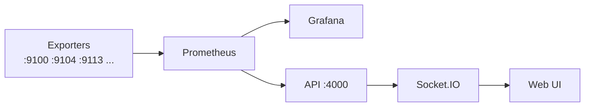
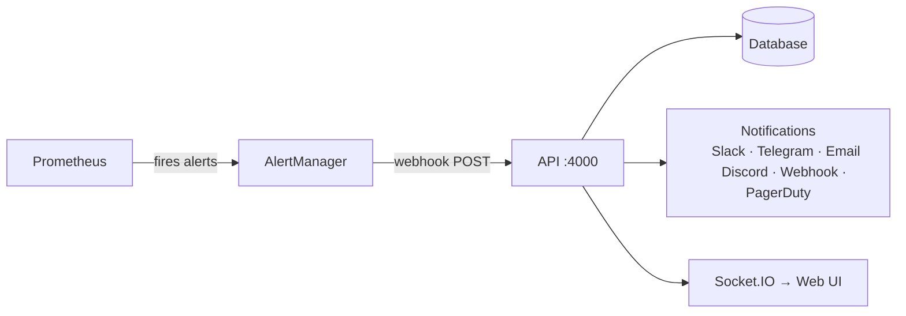
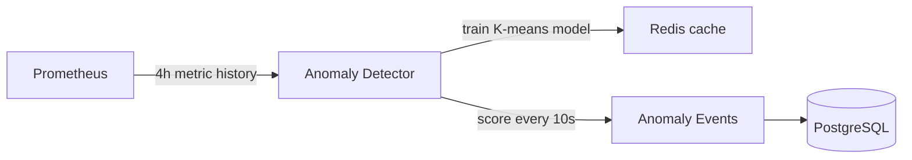

# Architecture Overview

## System Architecture

## Package Structure

| Package | Port | Purpose |
|---------|------|---------|
| `@nodeprism/web` | 3000 | Next.js management UI, proxies monitoring tools |
| `@nodeprism/api` | 4000 | Express REST API + Socket.IO + webhook handlers |
| `@nodeprism/config-sync` | 4002 | Syncs servers/agents to Prometheus target files, syncs status back |
| `@nodeprism/anomaly-detector` | 4003 | ML anomaly detection with K-means clustering |
| `@nodeprism/agent-app` | 9101 | Remote server monitoring agent |
| `@nodeprism/shared` | — | Shared TypeScript types, Zod schemas, utilities |

## Data Flow

### 1. Agent Registration

When an agent registers, the API creates server and agent records in PostgreSQL. Config Sync periodically reads the database and generates JSON target files. Prometheus watches these files for changes via `file_sd_configs`.

### 2. Metrics Collection

### 3. Alert Pipeline

AlertManager sends webhooks to the API when alerts fire or resolve. The API processes them, stores alert records, sends notifications through configured channels, and emits real-time Socket.IO events to connected browsers.

### 4. Anomaly Detection

The anomaly detector fetches 4 hours of historical data from Prometheus, trains K-means clustering models (cached in Redis), and scores current metrics every 10 seconds. When anomalies are detected, events are stored in the database and pushed via Socket.IO.

## Proxy Architecture

Prometheus, Grafana, and AlertManager bind to `127.0.0.1` only — they are not directly accessible from outside the server. They are accessed through Next.js proxy rewrites on port 3000:

| URL Path | Destination |
|----------|-------------|
| `/grafana/*` | `http://localhost:3030/grafana/*` |
| `/prometheus/*` | `http://localhost:9090/*` |
| `/alertmanager/*` | `http://localhost:9093/*` |

A Next.js middleware checks the `nodeprism_session` cookie on these paths, redirecting unauthenticated users to the login page.

In production, the Nginx reverse proxy on port 8443 sits in front of everything, adding rate limiting, security headers, gzip compression, and optional SSL/TLS.

## Ports Reference

| Service | Port | Binding |
|---------|------|---------|
| Web UI | 3000 | Public |
| API + Socket.IO | 4000 | Public |
| Config Sync | 4002 | Internal (no HTTP server) |
| Anomaly Detector | 4003 | Internal (no HTTP server) |
| Agent | 9101 | Public |
| Nginx Reverse Proxy | 8443 | Public |
| PostgreSQL | 5432 | Localhost |
| Redis | 6379 | Public |
| Prometheus | 9090 | 127.0.0.1 |
| Grafana | 3030 | 127.0.0.1 |
| AlertManager | 9093 | 127.0.0.1 |
| Loki | 3100 | Public |
| Pushgateway | 9091 | Public |
